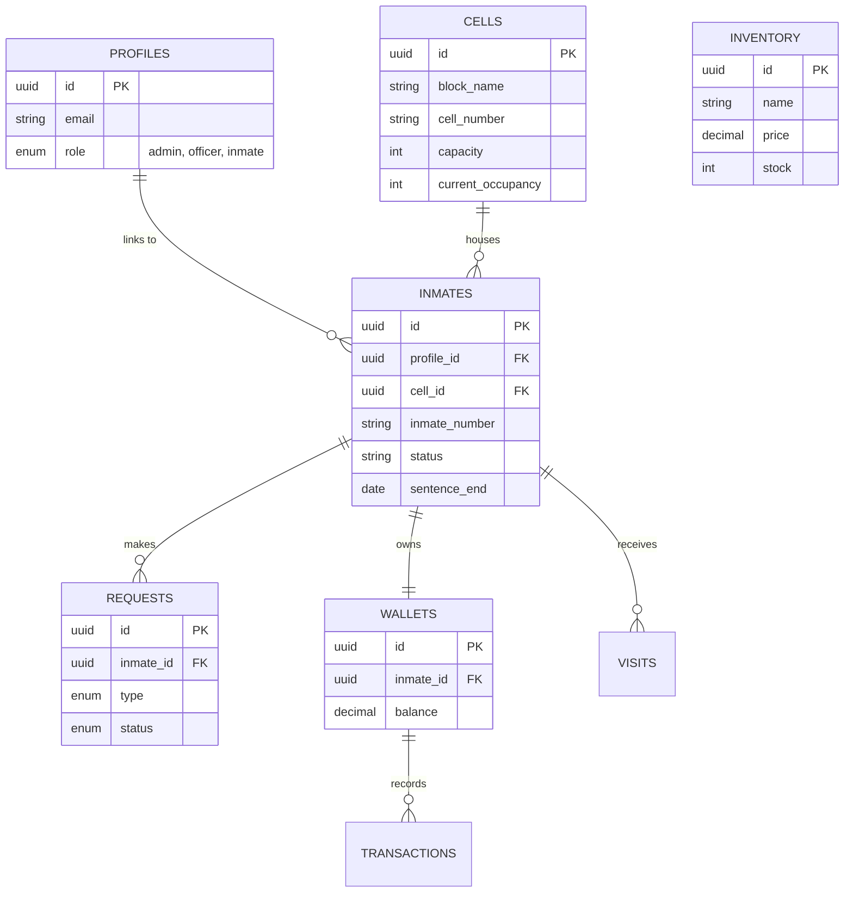
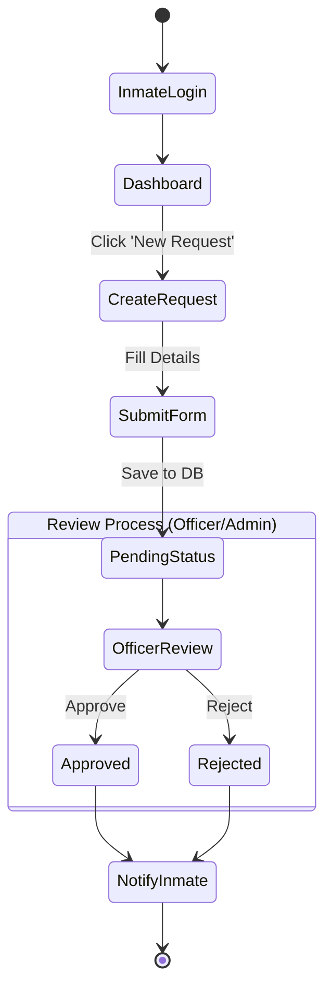

# 8. Methodology

## 8.1 System Development Methodology: Agile

For the development of the Smart Prison Management System, the **Agile Methodology** was adopted. This approach was chosen due to the project's requirement for iterative development, flexibility to changes, and continuous user feedback.

### Key Aspects of Agile Implementation:
*   **Iterative Development**: The project was broken down into manageable functional modules (e.g., Inmate Kiosk, Admin Dashboard, Officer Modules). Each module was developed, tested, and refined in short cycles (sprints).
*   **Continuous Feedback**: Regular checkpoints were established to review the UI/UX and functionality (e.g., modifying the "Facility Occupancy" chart to a Donut chart based on user preference).
*   **Adaptive Planning**: The roadmap evolved based on emerging requirements, such as adding the direct "Inmate Creation" flow to include cell assignment immediately.
*   **Rapid Prototyping**: We prioritized delivering working prototypes (MVP) of key interfaces like the Kiosk and Admin Panel to visualize the end product early.

## 8.2 Tools and Technologies

The system is built using a modern, scalable web application stack designed for performance, security, and user experience.

| Category | Technology | Usage/Description |
| :--- | :--- | :--- |
| **Frontend Framework** | **Next.js 14** (App Router) | React framework for server-side rendering, routing, and API handling. |
| **Language** | **TypeScript** | Ensures type safety and code maintainability across the full stack. |
| **Styling** | **Tailwind CSS** | Utility-first CSS framework for rapid, responsive, and custom design. |
| **UI Components** | **Shadcn/UI & Lucide React** | Accessible components and consistent iconography. |
| **Animations** | **Framer Motion** | Provides fluid micro-interactions and transitions for a premium feel. |
| **Backend / Database** | **Supabase** | Open-source Firebase alternative providing PostgreSQL, Auth, and Realtime subscriptions. |
| **Authentication** | **Supabase Auth** | Secure user management handling JSON Web Tokens (JWT) and RLS. |
| **Deployment** | **Vercel** (Recommended) | Optimized hosting platform for Next.js applications. |

## 8.3 System Design

### 8.3.1 System Architecture

The system follows a typical **Client-Server Architecture** leveraged by Next.js and Supabase. The frontend acts as the interface for different user roles, communicating with Supabase for data persistence and authentication.

```mermaid
graph TD
    subgraph "Client Layer (Frontend)"
        A[Inmate Kiosk UI]
        B[Officer Dashboard UI]
        C[Admin Portal UI]
    end

    subgraph "Application Layer (Next.js)"
        D[Next.js App Router]
        E[API Routes / Server Actions]
        F[Middleware (Auth Guard)]
    end

    subgraph "Data & Services Layer (Supabase)"
        G[PostgreSQL Database]
        H[Authentication Service]
        I[Realtime Engine]
        J[Storage Buckets]
    end

    A --> D
    B --> D
    C --> D
    D --> E
    D --> F
    E --> G
    E --> H
    I -.-> A
    I -.-> B
```

### 8.3.2 Use Case Diagram

This diagram illustrates the interactions between the three primary actors (Admin, Officer, Inmate) and the system's core functionalities.

```mermaid
usecaseDiagram
    actor "Admin" as A
    actor "Officer" as O
    actor "Inmate" as I

    package "Smart Prison System" {
        usecase "Manage Users & Roles" as UC1
        usecase "Manage Inventory" as UC2
        usecase "System Settings" as UC3
        usecase "View Analytics" as UC4
        
        usecase "Manage Inmates" as UC5
        usecase "Log Visits" as UC6
        usecase "Process Requests" as UC7
        
        usecase "Submit Request" as UC8
        usecase "View Wallet Balance" as UC9
        usecase "Purchase Items" as UC10
    }

    A --> UC1
    A --> UC2
    A --> UC3
    A --> UC4
    A --> UC5
    A --> UC7

    O --> UC5
    O --> UC6
    O --> UC7

    I --> UC8
    I --> UC9
    I --> UC10
```

### 8.3.3 Entity Relationship (ER) Diagram

The database schema is normalized and leverages Foreign Keys to maintain data integrity. RLS (Row Level Security) is applied at the table level.



### 8.3.4 Activity Diagram: Inmate Request Flow

This diagram details the flow of an inmate submitting a request (e.g., Medical or Commissary) and the subsequent approval process.



# 9. Proposed System Description

The **Smart Prison Management System** is a comprehensive, web-based solution designed to modernize correctional facility operations. Unlike legacy paper-based or siloed systems, this platform provides a unified interface for all stakeholders—Administrators, Officers, and Inmates.

### Key Improvements & Functionality:

1.  **Digital Inmate Integration (Kiosk Mode)**:
    *   **Self-Service**: Inmates access a restricted, secure dashboard to submit digital requests (medical, visitation, etc.), reducing paper waste and administrative overhead.
    *   **Financial Autonomy**: A built-in wallet features allows inmates to check balances and purchase permitted items from the commissary digitally, improving transparency.

2.  **Real-Time Administration**:
    *   **Live Analytics**: The Admin Dashboard provides real-time data on facility occupancy, inmate status distribution, and financial revenue, aiding in better decision-making.
    *   **Centralized Control**: Admins can manage staff roles, cell capacities, and store inventory from a single location with immediate updates across the system.

3.  **Enhanced Security & Efficiency**:
    *   **Role-Based Access Control (RBAC)**: Strict security policies ensure that inmates can only access their own data, while officers have access to operational tools without full administrative privileges.
    *   **Automated Workflows**: Cell occupancy is automatically tracked via database triggers, preventing human error in overcrowding checks.

4.  **Modern User Experience**:
    *   The system utilizes a "Premium" aesthetic with dark-mode optimization, smooth transitions, and intuitive navigation, reducing training time for staff and improving usability for inmates.

By bridging the gap between physical custody and digital management, the proposed system enhances operational efficiency, improves inmate welfare through transparency, and provides robust data for facility oversight.
